# School Management System - Class Diagram

This document contains a comprehensive UML class diagram for the School Management System project.

## Class Diagram

```mermaid
classDiagram
    %% Data Models
    class Student {
        +number id
        +string name
        +string email
        +string course
        +string status
        +string grade
        +string phone
        +string avatar
    }

    class Teacher {
        +number id
        +string name
        +string email
        +string subject
        +number students
        +number rating
        +string experience
        +string avatar
    }

    class Employee {
        +number id
        +string name
        +string email
        +string role
        +string department
        +string status
        +string phone
        +string avatar
    }

    class UserProfile {
        +string id
        +string username
        +string fullName
        +string email
        +string role
        +string profilePicture
        +string nationalId
        +string dateOfBirth
        +string fatherName
        +string motherName
        +string mobileNumber
        +string alternateMobile
        +string address
        +string city
        +string country
        +string emergencyContact
        +string emergencyRelation
        +string bloodGroup
        +string gender
        +string department
        +string joiningDate
        +string qualification
        +string experience
    }

    class Course {
        +number id
        +string name
        +string degree
        +string image
        +string duration
        +number students
        +number rating
        +string category
        +boolean isEnrolled
    }

    class AttendanceRecord {
        +string id
        +string name
        +string rollNumber
        +string className
        +string status
    }

    class StudentFormData {
        +string name
        +string email
        +string course
        +string phone
        +string grade
        +string status
    }

    class TeacherFormData {
        +string name
        +string email
        +string subject
        +string experience
        +number students
        +number rating
    }

    class EmployeeFormData {
        +string name
        +string email
        +string role
        +string department
        +string phone
        +string status
    }

    %% React Components
    class Dashboard {
        -boolean isAuthenticated
        -boolean isLoading
        -string studentSearchTerm
        -string teacherSearchTerm
        -string employeeSearchTerm
        -Student[] currentStudents
        -Teacher[] currentTeachers
        -Employee[] currentEmployees
        -UserProfile userProfile
        +handleSignIn()
        +handleSignOut()
        +handleAddStudent()
        +handleEditStudent()
        +handleDeleteStudent()
        +handleAddTeacher()
        +handleEditTeacher()
        +handleDeleteTeacher()
        +handleAddEmployee()
        +handleEditEmployee()
        +handleDeleteEmployee()
    }

    class Header {
        -UserProfile userProfile
        -boolean darkMode
        +onSettingsClick()
        +onSignOut()
        +onNotificationClick()
    }

    class SignIn {
        -string username
        -string password
        -boolean showPassword
        -string error
        -boolean isLoading
        +handleSubmit()
        +togglePasswordVisibility()
    }

    class DataTables {
        -Student[] currentStudents
        -Teacher[] currentTeachers
        -Employee[] currentEmployees
        -string studentSearchTerm
        -string teacherSearchTerm
        -string employeeSearchTerm
        +handleEditStudent()
        +handleDeleteStudent()
        +handleEditTeacher()
        +handleDeleteTeacher()
        +handleEditEmployee()
        +handleDeleteEmployee()
    }

    class Modals {
        -boolean showAddStudentModal
        -boolean showEditStudentModal
        -boolean showAddTeacherModal
        -boolean showEditTeacherModal
        -boolean showAddEmployeeModal
        -boolean showEditEmployeeModal
        -StudentFormData studentFormData
        -TeacherFormData teacherFormData
        -EmployeeFormData employeeFormData
        +handleSaveStudent()
        +handleSaveTeacher()
        +handleSaveEmployee()
        +handleClose()
    }

    class StatsCards {
        -boolean darkMode
        +render()
    }

    class AttendanceSheet {
        -string selectedDate
        -number classId
        -string section
        -AttendanceRecord[] records
        -boolean loading
        -string error
        +handleTogglePresent()
        +handleMarkAllPresent()
        +handleSave()
        +loadAttendance()
    }

    class ProfileSettings {
        -UserProfile userProfile
        -boolean isOpen
        -boolean isEditing
        +handleUpdateProfile()
        +handleSave()
        +handleCancel()
    }

    class TeacherCard {
        -Teacher teacher
        +onViewProfile()
        +onMessage()
    }

    class ErrorBoundary {
        -boolean hasError
        -Error error
        +componentDidCatch()
        +render()
    }

    %% API Routes
    class AttendanceRoute {
        +GET(request)
        -makeDummy()
        -getSampleData()
    }

    class AttendanceSaveRoute {
        +POST(request)
    }

    %% Backend Services
    class ExpressServer {
        -Object attendanceCache
        +get('/health')
        +get('/attendance')
        +post('/attendance')
        +listen()
    }

    class AttendanceCache {
        +Object cache
        +getAttendance()
        +saveAttendance()
    }

    %% Relationships
    Dashboard --> Student : manages
    Dashboard --> Teacher : manages
    Dashboard --> Employee : manages
    Dashboard --> UserProfile : uses
    Dashboard --> Header : contains
    Dashboard --> SignIn : contains
    Dashboard --> DataTables : contains
    Dashboard --> Modals : contains
    Dashboard --> StatsCards : contains

    Header --> UserProfile : displays

    SignIn --> UserProfile : creates

    DataTables --> Student : displays
    DataTables --> Teacher : displays
    DataTables --> Employee : displays

    Modals --> StudentFormData : uses
    Modals --> TeacherFormData : uses
    Modals --> EmployeeFormData : uses
    Modals --> Student : creates/updates
    Modals --> Teacher : creates/updates
    Modals --> Employee : creates/updates

    AttendanceSheet --> AttendanceRecord : manages
    AttendanceSheet --> AttendanceRoute : calls

    ProfileSettings --> UserProfile : edits

    TeacherCard --> Teacher : displays

    AttendanceRoute --> AttendanceRecord : returns
    AttendanceRoute --> ExpressServer : calls

    AttendanceSaveRoute --> ExpressServer : calls
    AttendanceSaveRoute --> AttendanceRecord : saves

    ExpressServer --> AttendanceCache : uses
    AttendanceCache --> AttendanceRecord : stores
```

## Component Relationships

### Frontend Architecture

1. **Dashboard Component** - Main container component that orchestrates all other components
   - Manages authentication state
   - Handles CRUD operations for Students, Teachers, and Employees
   - Contains child components: Header, SignIn, DataTables, Modals, StatsCards

2. **Data Management Components**
   - **DataTables**: Displays and manages lists of Students, Teachers, and Employees
   - **Modals**: Handles forms for creating/editing entities
   - **StatsCards**: Displays dashboard statistics

3. **Feature-Specific Components**
   - **AttendanceSheet**: Manages attendance records for students
   - **ProfileSettings**: Manages user profile information
   - **TeacherCard**: Displays teacher information cards
   - **SignIn**: Handles user authentication

4. **Utility Components**
   - **Header**: Navigation and user profile display
   - **ErrorBoundary**: Error handling wrapper

### Backend Architecture

1. **ExpressServer**: Main backend server
   - Handles HTTP requests
   - Manages attendance cache in memory
   - Provides RESTful API endpoints

2. **API Routes** (Next.js API Routes)
   - **AttendanceRoute**: GET endpoint for fetching attendance data
   - **AttendanceSaveRoute**: POST endpoint for saving attendance data

### Data Flow

1. **Authentication Flow**: SignIn → Dashboard (sets authentication state)
2. **Data Display Flow**: Dashboard → DataTables → Student/Teacher/Employee models
3. **Data Modification Flow**: Dashboard → Modals → FormData → Student/Teacher/Employee models
4. **Attendance Flow**: AttendanceSheet → AttendanceRoute → ExpressServer → AttendanceCache → AttendanceRecord
5. **Profile Flow**: ProfileSettings → UserProfile → Dashboard

## Key Design Patterns

1. **Container/Presentational Pattern**: Dashboard is a container component, while StatsCards, TeacherCard are presentational
2. **Form Data Pattern**: Separate FormData interfaces for form state management
3. **Component Composition**: Dashboard composes multiple smaller components
4. **State Management**: React hooks (useState) for local state management
5. **API Abstraction**: Next.js API routes abstract backend communication

